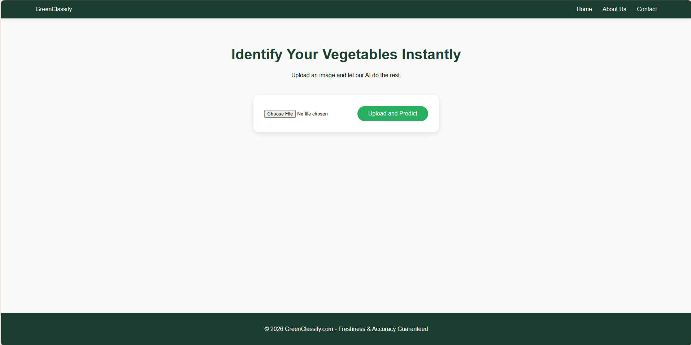
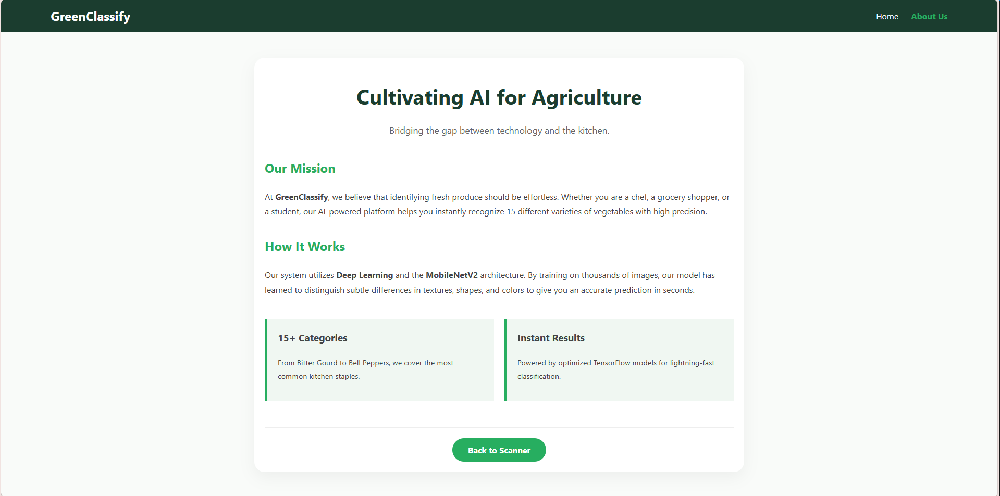
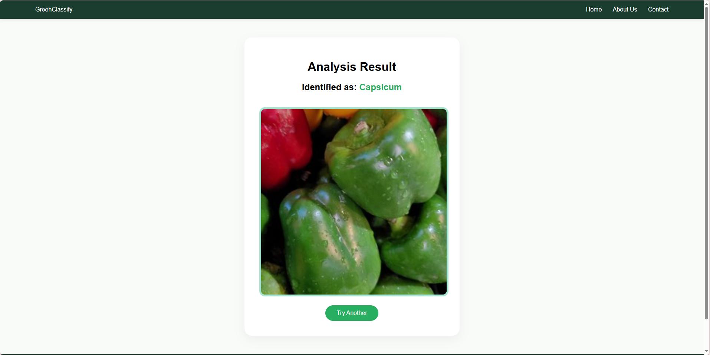

# GreenClassify 🥦 - Vegetable Classification System

GreenClassify is an AI-powered web application designed to automatically identify and classify vegetables from uploaded images using Deep Learning.

## 🌟 Project Overview
* **Model Architecture:** MobileNetV2 (Transfer Learning).
* **Classes:** 15 categories (Bean, Brinjal, Tomato, Carrot, etc.).
* **Backend:** Flask (Python).
* **Frontend:** Responsive HTML5/CSS3 UI.

## 📸 Screenshots
### Home Page


### About Section


### Prediction Result


## 🚀 How to Run Locally

1. **Clone the repository:**
       ```bash
       git clone [https://github.com/bhagwatankita/vegetable-classification.git](https://github.com/bhagwatankita/vegetable-classification.git)
       cd vegetable-classification

2. **Install dependencies:**

    Bash
    pip install -r requirements.txt

3. **Run the Flask application:**

    Bash
    python train_model.py
    (Note: Ensure your model file vegetable_model.h5 is in the root directory)

4. **Access in Browser:**
    Go to http://127.0.0.1:5000/


📂 Project Structure
    static/ - Contains CSS and UI images.
    
    templates/ - Contains HTML views.
    
    screenshots/ - App demo images.
    
    vegetable_model.h5 - The trained CNN model.
    
    train_model.py - Flask server and inference logic.
