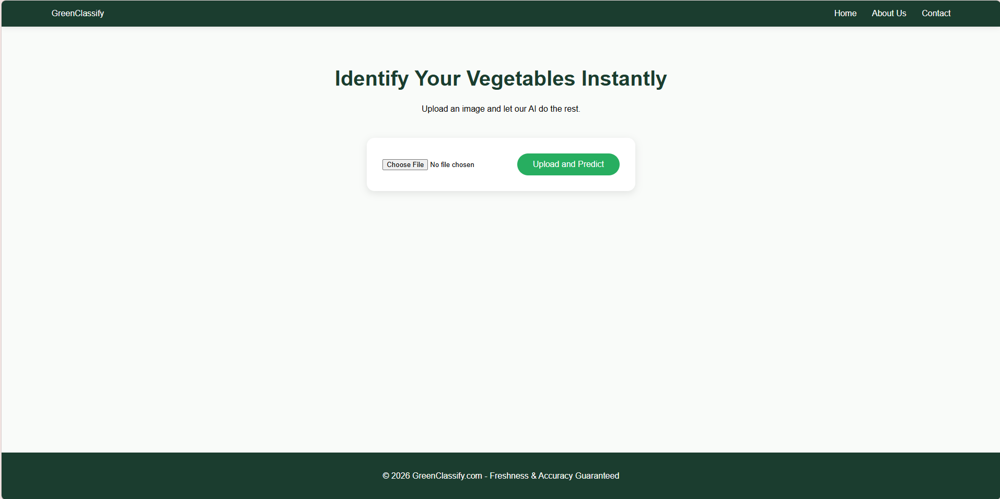
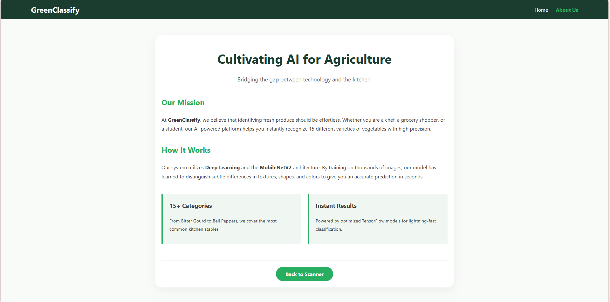
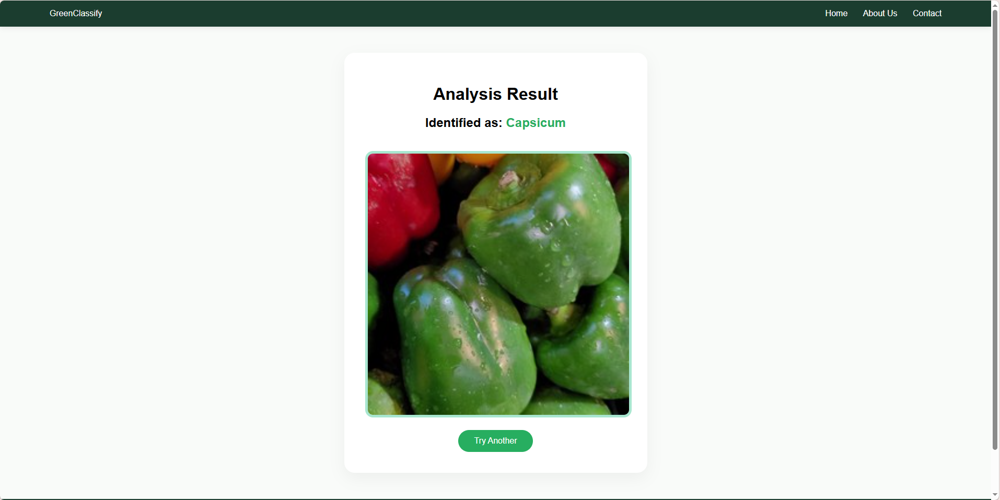

# GreenClassify 🥦 - Vegetable Classification System

GreenClassify is an AI-powered web application designed to automatically identify and classify vegetables from uploaded images using Deep Learning.

## 🌟 Project Overview
* **Model Architecture:** MobileNetV2 (Transfer Learning).
* **Classes:** 15 categories (Bean, Brinjal, Tomato, Carrot, etc.).
* **Backend:** Flask (Python).
* **Frontend:** Responsive HTML5/CSS3 UI.

## 📸 Screenshots
### Home Page

### About Section

### Prediction Result

📂 Project Structure
    static/ - Contains CSS and UI images.
    
    templates/ - Contains HTML views.
    
    screenshots/ - App demo images.
    
    vegetable_model.h5 - The trained CNN model.
    
    train_model.py - Flask server and inference logic.
